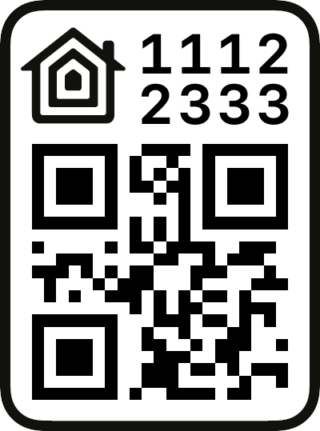
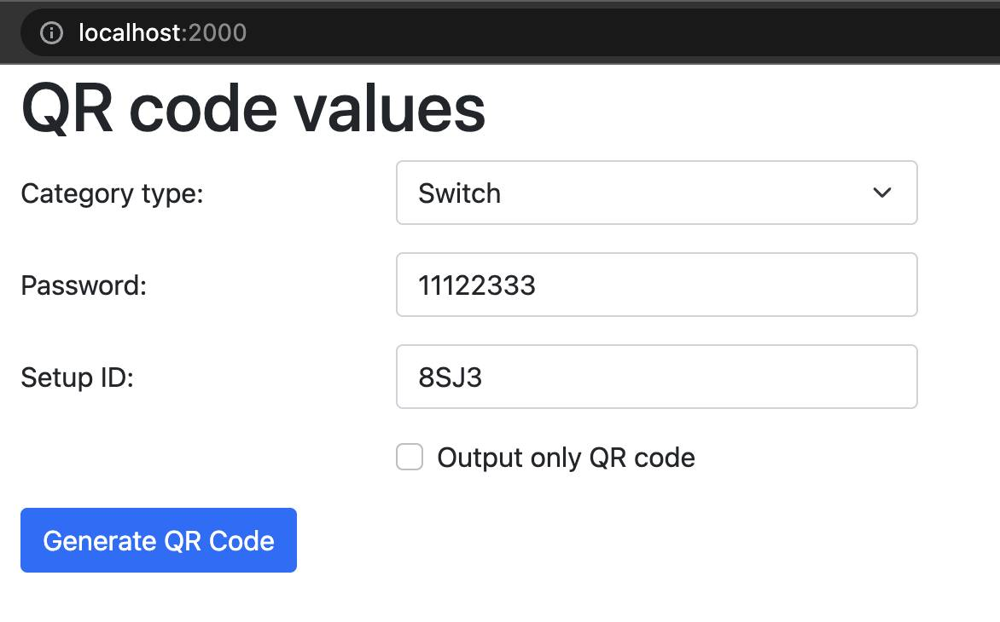

# Dockerized HomeKit QR code generator
Generator of QR code using for pairing HomeKit accessory

It's able to generate full image



or only QR code


# How to use?
Just call in console:
```console
docker-compose up
```

and visit: http://localhost:2000

# Form


